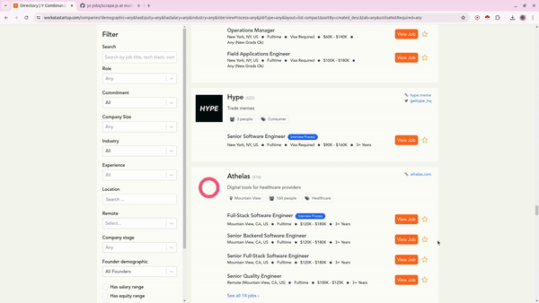

# YCombinator Jobs

Want all YC Jobs? Copy this script and run it in the Chrome JS Console


## How to Run

1. Open Jobs Page [YCombinator Jobs](https://www.workatastartup.com/companies)
2. Open Chrome Inspect Window and Console
3. Copy and Paste JavaScript Code Into Console
4. *The Console Automatically Places Output in Your Clipboard*
5. Paste Anywhere
6. Use [JSON to CSV Converter](https://www.convertcsv.com/json-to-csv.htm) to Get CSV / Sheets Data




## Output

```json
[
  {
      "companyYCombinatorURL": "https://www.workatastartup.com/companies/hatch",
      "newYCombinatorURL": "https://www.ycombinator.com/companies/hatch/jobs",
      "companyName": "Hatch",
      "companySite": "https://usehatchapp.com",
      "companyLocation": "Richmond, VA",
      "numPeople": " 73 people",
      "jobTitle": "Senior Software Engineer - Backend - Go",
      "jobURL": "https://www.workatastartup.com/jobs/15947",
      "jobLocation": "Remote (US)"
  },
  {
      "companyYCombinatorURL": "https://www.workatastartup.com/companies/hatch",
      "newYCombinatorURL": "https://www.ycombinator.com/companies/hatch/jobs",
      "companyName": "Hatch",
      "companySite": "https://usehatchapp.com",
      "companyLocation": "Richmond, VA",
      "numPeople": " 73 people",
      "jobTitle": "User Experience Designer",
      "jobURL": "https://www.workatastartup.com/jobs/67480",
      "jobLocation": "Remote (US)"
  },
  {
      "companyYCombinatorURL": "https://www.workatastartup.com/companies/hatch",
      "newYCombinatorURL": "https://www.ycombinator.com/companies/hatch/jobs",
      "companyName": "Hatch",
      "companySite": "https://usehatchapp.com",
      "companyLocation": "Richmond, VA",
      "numPeople": " 73 people",
      "jobTitle": "Senior Product Manager - AI",
      "jobURL": "https://www.workatastartup.com/jobs/41841",
      "jobLocation": "Remote (US)"
  }
]
```
